<p align="center">
  
</p>

<p align="center">
  <a href="https://github.com/liberta09/CloudStreamRepoManager/releases/latest"></a>
  
  
  
  <a href="https://t.me/+o-RFlV4U3UY5NGU8"></a>
</p>

<p align="center">
  <b>CloudStream için hazırlanmış, doğrulanmış eklenti repolarını tek listede toplayan<br/>ve tek dokunuşla uygulamaya aktaran katalog yöneticisi.</b>
</p>

<br/>

<p align="center">
  <a href="https://github.com/liberta09/CloudStreamRepoManager/releases/latest/download/CSRepoManager_User.apk"></a>
  &nbsp;
  <a href="https://t.me/+o-RFlV4U3UY5NGU8"></a>
</p>

<p align="center">
  <sub>Her zaman en güncel sürüm iner · <a href="https://github.com/liberta09/CloudStreamRepoManager/releases">Tüm sürümler</a></sub>
</p>

<br/>

## ✨ Neler yapabilir?

<table>
  <tr>
    <td width="50%" valign="top">
      <h3>⚡ Tek tıkla aktarım</h3>
      Repo'nun altındaki <b>CloudStream'e Aktar</b> düğmesine dokun. CloudStream açılır ve repoyu eklemek için onay ister. Adres kopyalamak yok.
    </td>
    <td width="50%" valign="top">
      <h3>☁️ Canlı katalog</h3>
      Uygulama her açıldığında doğrulanmış merkezi listeyi buluttan çeker. Yeni repolar, güncelleme beklemeden listende görünür.
    </td>
  </tr>
  <tr>
    <td width="50%" valign="top">
      <h3>📦 Hazır Türkçe kaynaklar</h3>
      Film, dizi, canlı TV ve spor için en çok kullanılan Türkçe repolar tek yerde. İngilizce, Hintçe, Almanca, Fransızca ve İtalyanca kaynaklar da var.
    </td>
    <td width="50%" valign="top">
      <h3>🛠️ Oynatma ve link çözücü</h3>
      Vidmoly, Doodstream, Filemoon gibi oynatıcılar için gereken çözücüleri (extractor) tek dokunuşla CloudStream'e yükler.
    </td>
  </tr>
  <tr>
    <td width="50%" valign="top">
      <h3>🔎 Arama ve favoriler</h3>
      Repoları isme, kategoriye ya da koda göre ara. Sık kullandıklarını favorilere ekle, en üstte dursun.
    </td>
    <td width="50%" valign="top">
      <h3>📺 Android TV hazır</h3>
      Kumandayla gezinmek için tam odak desteği. Seçili kart her zaman belirgin görünür.
    </td>
  </tr>
</table>

## 🗂️ Katalog

<p>
  
  
  
  
  
  
  
</p>

Liste [`central_repos.json`](central_repos.json) dosyasından canlı olarak okunur. Yukarıdaki repo sayısı da bu dosyadan otomatik hesaplanır.

## 📥 Kurulum

<details open>
<summary><b>📱 Telefon ve tablet</b></summary>
<br/>

1. Yukarıdaki **APK İndir** düğmesine dokun.
2. İnen `CSRepoManager_User.apk` dosyasını aç.
3. Uyarı çıkarsa **Ayarlar → Bilinmeyen kaynaklardan yüklemeye izin ver** seçeneğini aç.
4. **Yükle**'ye dokun.

</details>

<details>
<summary><b>📺 Android TV ve TV Box</b></summary>
<br/>

1. TV'ye Play Store'dan **Downloader** ya da **Send Files to TV** uygulamasını kur.
2. APK'yı telefondan ya da bilgisayardan TV'ye gönder. Downloader kullanıyorsan şu adresi yaz:
   ```
   github.com/liberta09/CloudStreamRepoManager/releases/latest/download/CSRepoManager_User.apk
   ```
3. TV'deki dosya yöneticisinden APK'yı aç ve kurulumu onayla.

</details>

## 🚀 Repo nasıl eklenir?

| | |
|:-:|---|
| **1** | **CloudStream Repo Manager**'ı aç. |
| **2** | İstediğin reponun altındaki **⚡ CloudStream'e Aktar** düğmesine dokun. |
| **3** | CloudStream kendiliğinden açılır. **"Bu eklenti reposu eklensin mi?"** penceresinde onayla. |
| **4** | CloudStream'de **Ayarlar → Uzantılar**'dan istediğin eklentileri indir. |

> [!TIP]
> Yayınlar açılmıyorsa ana ekrandaki **🛠️ Oynatma / Link Çözücü** düğmesine dokun. Eksik çözücüler yüklenir, çoğu sorun böyle düzelir.

## 💬 Destek ve duyurular

Yeni repolar, güncellemeler ve duyurular önce Telegram'da paylaşılır. Soru, istek ve hata bildirimlerini de oradan iletebilirsin.

<p>
  <a href="https://t.me/+o-RFlV4U3UY5NGU8"></a>
</p>

## 📄 Lisans

Bu proje açık kaynaklıdır ve **MIT Lisansı** altında sunulur.

<p align="center"><sub>CloudStream Repo Manager bağımsız bir projedir; CloudStream geliştiricileriyle bir bağı yoktur. Katalogdaki repolar üçüncü taraflara aittir.</sub></p>
